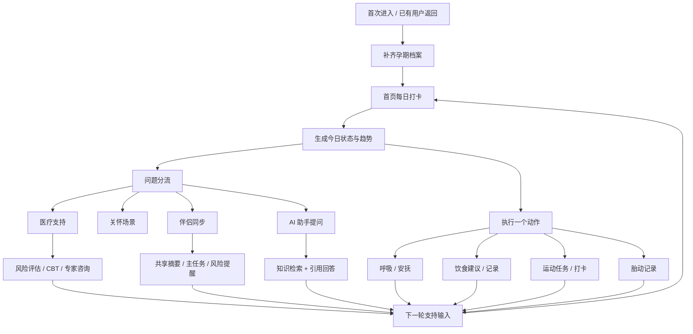
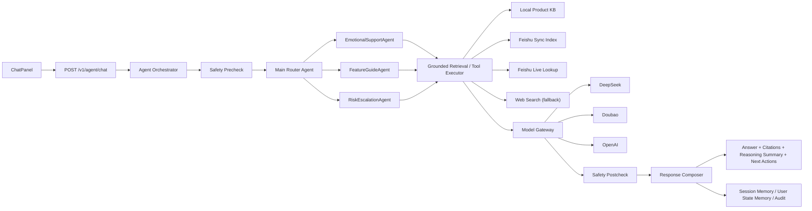

# 妊安 APP 当前系统使用说明

本文档以 [`agent-iteration-roadmap.md`](./agent-iteration-roadmap.md) 为最终落地范式，整理当前仓库中已经真实存在的产品能力、AI 链路、技术架构、边界和阶段判断。它的目标不是写一篇营销式介绍，而是提供一份可对外展示、可对内协同、可长期维护的系统说明底稿。

## 阅读指引

这份文档同时面向三类读者：

- 产品演示场景：重点看“主流程”“核心模块”“演示路径”
- 研发协同场景：重点看“底层技术架构”“当前边界”“阶段判断”
- 对外交付场景：重点看“系统定位”“能力总览”“FAQ”“术语表”

如果你是第一次通读，建议按下面顺序阅读：

1. 当前系统定位
2. 用户主流程与功能链路
3. 核心模块逐项说明
4. 底层技术架构
5. 当前边界与阶段判断
6. FAQ 与术语表

## 目录

- [1. 当前系统定位](#system-positioning)
- [2. 当前产品能力总览](#capability-overview)
- [3. 用户主流程与功能链路](#user-flow)
- [4. 核心模块逐项说明](#module-breakdown)
- [5. 底层技术架构](#architecture)
- [6. 当前边界与未完成层](#boundaries)
- [7. 当前版本与阶段判断](#phase-status)
- [8. 下一步建议与演示路径](#next-steps)
- [附录 A：适用对象与典型场景](#appendix-a)
- [附录 B：对外演示脚本](#appendix-b)
- [附录 C：FAQ](#appendix-c)
- [附录 D：术语表](#appendix-d)

---

## 1. 当前系统定位

妊安当前不是自由发挥型的全能 Agent，也不是单纯记录孕期数据的轻工具。结合当前前后端实现，它更准确的产品定义是：

**围绕孕期稳态管理构建的受控知识增强型对话助手与陪伴式 APP**

当前系统的核心定义可以进一步拆成四层：

- `规则优先`
- `风险强拦截`
- `检索增强`
- `LLM 受控生成`

它解决的不是一个点状问题，而是一条连续链路：

1. 先理解用户当前状态
2. 再给出一个当下可执行动作
3. 在必要时把问题分流到关怀、医疗支持、伴侣协同和 AI 助手
4. 用结构化记录、知识检索和风险识别把下一轮支持承接起来

因此，妊安当前最接近的产品形态不是“通用聊天机器人”，而是：

- 有主流程的孕期陪伴产品
- 有明确边界的风险支持工具
- 有知识证据链的 AI 问答模块
- 有协作能力的伴侣支持系统

---

## 2. 当前产品能力总览

当前仓库中已经形成了较完整的 MVP 主链路，重点能力包括：

- 首页稳态链路：欢迎卡、孕周进度、每日打卡、呼吸练习、趋势、胎动、饮食、运动、伴侣卡片和 CBT 快捷入口
- 关怀场景链路：按情绪安抚、身体照护、伴侣协同、专业支持等场景组织内容
- 医疗支持链路：知识库、风险评估、CBT 计划中心、专家咨询与紧急支持入口
- 伴侣同步链路：邀请码绑定、共享分级、风险提醒、任务同步和伴侣视角摘要
- AI 助手链路：带引用、带思考摘要、带下一步建议的结构化问答
- 支持中心链路：帮助中心、使用文档、版本说明、隐私设置和紧急联系人

如果从产品体验角度总结，妊安当前已经具备以下闭环：

- `记录 -> 建议 -> 行动 -> 反馈`
- `状态 -> 风险识别 -> 结构化承接`
- `个人体验 -> 伴侣协作`
- `用户提问 -> 知识检索 -> 证据回答`

这意味着妊安已经不是几个功能卡片的集合，而是一个有“主入口、分流逻辑、专业承接、支持回流”的系统。

---

## 3. 用户主流程与功能链路

### 3.1 推荐主流程

典型用户日常使用顺序如下：

1. 完成基础档案建档
2. 进入首页完成每日打卡
3. 查看系统给出的当日重点动作
4. 完成一个呼吸、记录、饮食或运动任务
5. 根据状态决定是否进入关怀、医疗支持或伴侣同步
6. 在有具体问题时进入 AI 助手提问

### 3.2 用户功能流程图

### 3.3 主流程理解重点

- 首页不是内容展示页，而是“稳态入口”
- 关怀不是知识库，而是“场景分流器”
- 医疗支持不是诊断系统，而是“结构化承接层”
- 伴侣同步不是社交功能，而是“支持动作翻译器”
- AI 助手不是自由对话机器人，而是“受控知识增强问答入口”

---

## 4. 核心模块逐项说明

以下每个模块都按统一模板说明：

- 它解决什么问题
- 用户从哪里进入
- 用户在这个模块里的典型流程
- 它在系统架构里依赖什么

### 4.1 首页稳态链路

**解决什么问题**

解决“我今天状态怎么样、我现在先做什么”的问题，是日常使用最高频入口。

**用户从哪里进入**

打开应用默认进入首页，也可以通过底部导航随时返回。

**典型流程**

查看孕周和欢迎信息 -> 完成情绪、睡眠、触发因素和备注打卡 -> 获取今日建议 -> 执行呼吸、胎动、饮食、运动或 CBT 快捷动作 -> 查看趋势变化。

**架构依赖**

依赖用户档案、孕周上下文、`checkin` 本地存储、趋势计算、饮食/运动推荐器、胎动记录逻辑与伴侣摘要卡片。

### 4.2 关怀场景链路

**解决什么问题**

解决“我不想先看很多知识，我只想知道当前场景应该怎么做”的问题。

**用户从哪里进入**

从底部导航进入“关怀”，或由首页状态与建议进入特定场景。

**典型流程**

选择情绪安抚 / 身体照护 / 伴侣协同 / 专业支持场景 -> 获取更符合当前状态的一条行动 -> 执行动作或继续进入专业承接。

**架构依赖**

依赖近期打卡数据、care wellness 聚合逻辑、CBT 风险判断和内容素材的二次组织。

### 4.3 医疗支持链路

**解决什么问题**

解决“我的问题已经超出一般安抚，需要更结构化、更专业的承接”的问题。

**用户从哪里进入**

从底部导航进入“医疗支持”，或从首页 / 关怀在风险上升时跳转进入。

**典型流程**

浏览知识库 -> 进入风险评估 -> 如需持续支持则进入 CBT 计划中心 -> 必要时查看专家咨询和紧急支持信息。

**架构依赖**

依赖知识库内容、风险评估逻辑、CBT 状态机、支持中心数据和承接型页面结构。

### 4.4 伴侣同步链路

**解决什么问题**

解决“伴侣不知道现在该怎么帮、用户又不想反复解释”的问题。

**用户从哪里进入**

从“我的”进入伴侣同步中心，也会在首页摘要卡片中看到伴侣协作提示。

**典型流程**

生成邀请码 -> 伴侣绑定 -> 选择共享等级 -> 系统生成今日状态摘要与主任务 -> 伴侣按任务执行支持 -> 用户调整共享等级或解绑。

**架构依赖**

依赖 partner sync 状态、打卡结果、风险评估摘要、任务回写、共享等级策略和隐私设置。

### 4.5 饮食与运动建议链路

**解决什么问题**

解决“今天吃什么、动多少、哪些动作需要避免”的具体执行问题。

**用户从哪里进入**

主要通过首页卡片进入，也可以通过测试页和相关模块单独查看。

**典型流程**

系统读取孕周、体重、过敏史、风险等级和运动基础 -> 生成今日饮食目标与运动任务 -> 用户记录和打卡 -> 作为下一轮推荐输入。

**架构依赖**

依赖营养建议计算器、运动推荐器、孕期禁忌规则、记录存储与首页卡片组件。

### 4.6 AI 助手链路

**解决什么问题**

解决“我现在有一个具体问题，希望得到有依据、有边界、能执行的回答”的问题。

**用户从哪里进入**

通过 `ChatPanel` 进入，也可由预设问题、场景入口和后续建议触发。

**典型流程**

前端发送消息 -> 后端统一编排 -> 风险预检 -> 路由到子 Agent -> 调用知识和 Skill -> 基于证据生成回答 -> 输出引用、思考摘要、下一步建议。

**架构依赖**

依赖 `orchestratorService`、`routerAgent`、`precheck` / `postcheck`、sub-agents、知识检索、模型网关、response composer、memory 和 audit。

### 4.7 设置 / 帮助 / 版本说明链路

**解决什么问题**

解决“如何管理账号和隐私、如何理解产品、如何查看更新、如何获得帮助”的问题。

**用户从哪里进入**

从“我的”进入个人档案、隐私设置、帮助中心、使用文档、版本说明和紧急支持。

**典型流程**

管理提醒和账号 -> 查看隐私和伴侣共享策略 -> 进入帮助中心、使用文档、版本说明 -> 必要时查看紧急支持联系人。

**架构依赖**

依赖 profile mock API、本地设置状态、版本元数据、帮助中心数据、紧急联系人数据和页面导航状态。

---

## 5. 底层技术架构

这一部分不是抽象蓝图，而是对当前仓库里已经存在的实现层做整理。

### 5.1 前端层

前端当前可概括为：

`App -> Tab -> Center/Page -> Card/Modal`

各层职责如下：

- `App`：全局状态、底部导航、页面切换和主流程组织
- `Tab`：首页、关怀、医疗支持、我的四个主导航承接层
- `Center/Page`：专业中心页、帮助页、版本说明页、使用文档页、测试页
- `Card/Modal`：打卡、呼吸、饮食、运动、伴侣同步、记录填写等最小交互单元

### 5.2 数据与状态层

当前系统采用“本地存储 + mock API + 本地服务状态文件”的组合方式承接开发和演示：

- 每日打卡使用本地存储持久化
- CBT 计划状态使用本地存储持久化
- 伴侣同步前端侧有本地状态承接
- 后端 `server/data/partner-sync-state.local.json` 用于本地服务状态
- 知识侧使用本地知识数据 + `server/kb/*.local.json` 本地快照

这使得当前系统具备：

- 单设备连续体验
- 本地演示可复现
- 页面刷新后状态可保留

同时也意味着：

- 当前并非完整多端实时同步架构
- 仍以 MVP / 演示友好方式为主

### 5.3 后端与服务层

后端目前已经具备三类核心接口能力：

- 基础支持接口
  - `partner-sync`
  - `profile`
  - `help center`
  - `emergency contacts`
- 知识接口
  - `/v1/knowledge/overview`
  - `/v1/knowledge/search`
  - `/v1/knowledge/documents/:documentId`
- Agent 接口
  - `/v1/agent/chat`
  - `/v1/agent/presets`
  - `/v1/agent/sessions/:sessionId/history`
  - `/v1/agent/escalations`

### 5.4 AI / 知识 / 模型全链路

当前 AI 主链路可以描述为：

`ChatPanel -> /v1/agent/chat -> Agent Orchestrator -> Safety Precheck -> Main Router Agent -> Sub Agent -> Grounded Retrieval / Skills -> Model Gateway -> Safety Postcheck -> Response Composer -> Memory + Audit`

### 5.5 知识优先级

当前知识优先级与 roadmap 保持一致：

1. 本地产品知识
2. 飞书同步知识
3. 飞书实时补查
4. 联网搜索

这意味着当前系统不是“默认联网搜”，而是“优先命中产品知识和受控知识源”。

### 5.6 安全机制

安全机制是当前系统的核心边界之一：

- `Safety Precheck`
  - 输入预检
  - 高风险优先拦截
  - 明显越界问题不走普通回答链路
- `Safety Postcheck`
  - 输出越界审查
  - 免责声明补充
  - 必要时降级或升级
- `RiskEscalationAgent`
  - 承接更高风险问题
  - 输出更明确的安全动作

### 5.7 模型角色

当前模型的角色非常明确：

- 模型主要负责“基于证据生成回答”
- 模型不自由决定知识来源
- 模型不拥有完全开放的工具调度权
- 编排层、规则层和技能层仍然是主控层

因此，妊安当前 AI 的强项不是“自由发挥”，而是：

- 解释性更强
- 风险边界更稳
- 证据引用更清楚
- 产品风格更可控

---

## 6. 当前边界与未完成层

对外说明时，这一部分必须明确，不然会把系统描述得比真实实现更大。

### 6.1 当前已经不是的东西

妊安当前还不是：

- 完全自主型多模态智能体
- 可稳定拆解复杂任务的通用 Planner Agent
- 带完整运营后台和评估闭环的成熟 AI 平台

### 6.2 仍未完成的关键层

结合 roadmap，当前缺失的关键层主要包括：

- 多模态理解层
  - 图片输入统一协议
  - 语音输入统一协议
  - 附件级结构化上下文注入
- 任务规划层
  - 多步任务拆解
  - 澄清状态机
  - Planner / Executor 分层
- 个性化策略层
  - 稳定偏好提炼
  - 个性化回答和推荐策略
- 评估闭环层
  - 命中率评估
  - 漏检与误路由监控
  - Prompt / Skill / 知识效果对比
- 运营后台层
  - Prompt 管理
  - 风险规则管理
  - 知识发布与审核流程

### 6.3 医疗边界

医疗支持、风险评估、CBT 承接和 AI 助手的作用边界是：

- 帮助更早识别问题
- 帮助组织知识和行动建议
- 帮助用户决定下一步支持路径

但它们不替代：

- 线下急诊
- 医生面诊
- 正式诊断
- 紧急救治

---

## 7. 当前版本与阶段判断

### 7.1 当前版本状态

当前版本已经具备：

- 文档入口
- 版本说明页
- 首页稳态闭环
- 关怀场景入口
- 医疗支持承接
- 伴侣同步中心
- AI 助手结构化问答

### 7.2 与 roadmap 的映射关系

结合 [`agent-iteration-roadmap.md`](./agent-iteration-roadmap.md)，当前阶段可判断为：

**Phase 1 已具雏形，Phase 2 局部落地，产品侧前端承接已清晰成型。**

已落地部分：

- Phase 1：知识底座雏形
  - 本地产品知识
  - 飞书同步快照
  - 统一知识检索接口
  - 回答引用展示
- Phase 2：部分 Prompt / Skill / 结构化回答
  - Prompt presets
  - router + sub-agent 路由
  - 检索类 Skill
  - 多模型网关
  - reasoning summary / citations / next actions
- 产品侧承接
  - 首页
  - 关怀
  - 医疗支持
  - 伴侣同步
  - 支持中心

未完全落地部分：

- Phase 3：多模态统一输入层
- Phase 4：任务规划层
- Phase 5：个性化和评估闭环
- 运营后台与版本化治理能力

### 7.3 当前阶段的正确表述

对内外统一建议使用的表述是：

> 妊安当前已经是一个围绕孕期稳态管理的产品化 MVP，其中 AI 助手采用受控知识增强架构。它具备清晰主流程、结构化支持模块和带证据的问答能力，但尚未进入完全自主、多模态、可规划的通用 Agent 阶段。

---

## 8. 下一步建议与演示路径

### 8.1 推荐演示路径

为了最清楚地体现当前产品闭环，建议按下面顺序演示：

1. 首页完成一次每日打卡
2. 展示呼吸安抚或一个可执行动作
3. 展示饮食 / 运动建议卡片
4. 进入关怀场景，展示按问题给动作
5. 进入医疗支持，展示风险评估或 CBT 计划
6. 进入“我的”，展示伴侣同步中心
7. 最后进入 AI 助手，提一个需要知识引用的问题

### 8.2 文档维护建议

后续迭代建议坚持“两处同步、单一内容源”的原则：

- 仓库 Markdown 长文档作为完整底稿
- 应用内使用文档作为压缩展示版
- 版本说明只承接 release notes，不替代系统说明

### 8.3 下一步实现优先级建议

如果继续按 roadmap 推进，建议顺序仍然是：

1. 巩固知识底座与飞书链路
2. 强化 Prompt Pack 与 Skill
3. 明确多模态输入协议
4. 再进入任务规划层
5. 最后做个性化和评估闭环

这样可以保证当前系统继续沿着“可信、可控、可解释”的路线演进，而不是过早追求通用智能体外观。

---

## 附录 A：适用对象与典型场景

### A.1 适用对象

当前版本最适合以下对象使用或演示：

- 孕期用户：需要稳定记录、情绪安抚、饮食运动建议和明确下一步动作
- 伴侣 / 家属：需要知道当前该怎么支持，而不是看到大量难以执行的信息
- 产品 / 运营 / 医疗协作团队：需要理解产品主链路、边界和当前 MVP 的真实能力
- 研发团队：需要基于统一定义继续推进 AI、知识和前端承接能力

### A.2 典型场景

- 日常稳态管理：每天完成一次打卡和一个动作
- 焦虑波动安抚：先回到身体可控，再决定是否升级支持
- 专业支持承接：在风险上升时进入 CBT、知识库或专家咨询入口
- 伴侣协作：把用户状态翻译成伴侣可执行任务
- 有依据的问答：用 AI 助手获取带知识引用的回答

---

## 附录 B：对外演示脚本

下面是一条适合产品演示、汇报或路演使用的标准脚本：

1. 从首页开始，先展示孕周与欢迎信息
2. 完成一次每日打卡，说明系统如何记录情绪、睡眠和触发因素
3. 展示系统如何给出一个今日动作，例如呼吸、饮食或运动建议
4. 进入关怀页面，说明它如何按场景组织行动，而不是堆知识
5. 进入医疗支持，展示风险评估、CBT 计划或知识库
6. 进入“我的”，展示伴侣同步如何把状态转译成支持动作
7. 最后进入 AI 助手，提一个需要证据回答的问题，展示引用、思考摘要和下一步建议

如果时间更短，可以压缩成：

- 首页打卡
- 医疗支持
- 伴侣同步
- AI 助手

---

## 附录 C：FAQ

### C.1 妊安当前最准确的产品定义是什么？

妊安当前最准确的产品定义是：**围绕孕期稳态管理构建的受控知识增强型对话助手与陪伴式 APP**。

### C.2 当前 AI 为什么不是自由发挥？

因为当前链路先做风险判断和意图路由，再按知识优先级取证据，最后才调用模型生成回答。模型不是唯一决策者，而是编排链路中的生成环节。

### C.3 为什么强调“受控知识增强”？

因为当前系统的目标不是表现成通用聊天机器人，而是让回答更可信、边界更清楚、来源更可解释。

### C.4 当前最适合展示什么？

最适合展示首页稳态闭环、关怀场景分流、医疗支持承接、伴侣同步协作，以及带引用的 AI 问答能力。

### C.5 当前最不适合被描述成什么？

不适合被描述成“完全自主型多模态智能体”“会稳定规划复杂任务的通用 Agent”或“能够替代医疗服务的系统”。

---

## 附录 D：术语表

- `稳态管理`
  当前产品对“先把状态拉回可控，再处理后续问题”的统一表达。
- `受控知识增强型对话助手`
  指回答依赖知识源、规则和安全层，而不是完全自由生成。
- `Safety Precheck`
  输入侧风险预检，用于高风险拦截和升级。
- `Safety Postcheck`
  输出侧安全审查，用于越界过滤、免责声明补充和降级。
- `Main Router Agent`
  主路由层，负责识别意图、判断主题和选择进入哪个子 Agent。
- `Sub Agent`
  当前由情绪支持、功能导览和风险升级等子 Agent 组成。
- `Grounded Retrieval`
  从本地知识、飞书同步、飞书实时补查和联网搜索中取回证据的过程。
- `Model Gateway`
  模型调用网关，当前承接 DeepSeek、Doubao、OpenAI 等模型。
- `Response Composer`
  最终输出整合层，负责把主回答、引用、思考摘要、下一步建议拼成统一返回结构。
